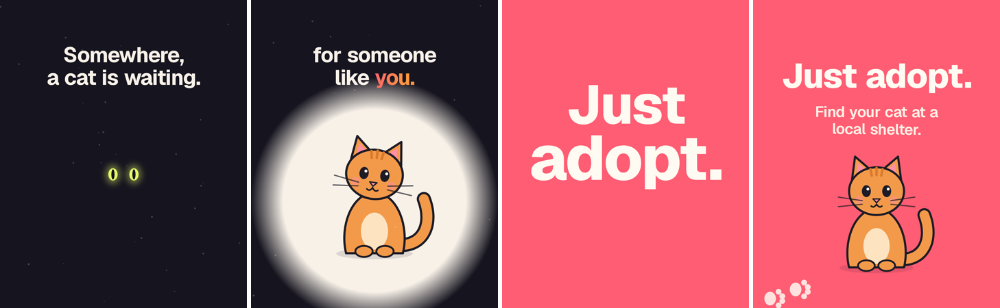

# Just adopt

An 18 s, 4:5 (1080×1350) promo encouraging cat adoption, made with the motion-design skill. The cats, heart, yarn and paw prints are drawn in code; there are no photos, statistics or organisation names.

<p align="center"></p>

Story and timing are in [`BEATMAP.md`](BEATMAP.md) (100 BPM, drop at 7.2 s).

## Status
- Done: `film.html`, the beat map and approved-direction stills (`preview.png`).
- Not done yet: the full render and the sound. The plan for sound is a gentle 100 BPM track and soft SFX generated in code (pop on the heart, whoosh on the drop, purr rumble, paw taps), or a Mixkit track if `assets.mixkit.co` is reachable.

## Render
```bash
cd examples/just-adopt
python fetch_assets.py                     # Geist font -> fonts/
python -m http.server 8000 &               # serve the film
python render.py probe 1.4 3.6 7.9 15.6 --size 1080x1350 --duration 18                    # 4 stills -> probe/sheet.png
python render.py beats --size 1080x1350 --duration 18 --bpm 100 --beat-offset 0.3         # one frame per beat -> beats/beats.png
python render.py full  --size 1080x1350 --duration 18                                     # 60 fps, 8 subframes -> out/video.mp4 (~20-25 min)
```
`render.py` is a copy of `skill/motion-design/scripts/render_template.py`.
